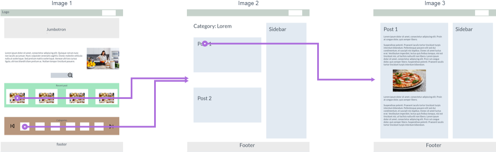
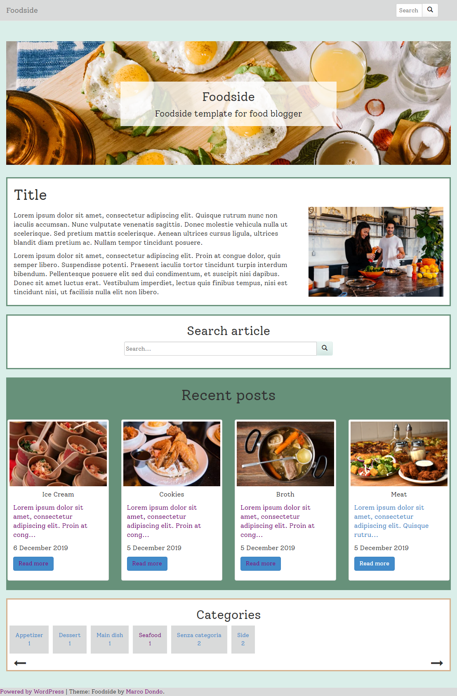

# WordpressTheme-Foodside

Wordpres theme based on bootstrap for food blogs and recipes.

<h2> Introduction </h2>
Simple and minimal theme for blog based on wordpress.

The aim of this project is to create a blog theme for wordpress.

<h2> Description </h2>

To create this theme I downloaded a starter blank theme on underscores, link: https://underscores.me/
After that i linked the blank project with bootstrap and Jquery libraries throught function.php file.

To create the graphic mockup i used Marvel prototype, link: https://marvelapp.com/

In the index page there are some sections:

- The section to insert the last sticky post (this section is thought to insert a welcome post or a presentation post);

- The form to search posts (or food recipes);

- The section for the recent posts;

- The horizontal section scrollable to search the categories.


I also created two customized pages:

1. About page: to display the writers of the blog (authors.php):

2. Contact page: to display contact form to send a message to the admin (contact.php), this page works thanks to SMTP protocol: make sure your hosting service enabled this service.

<b> To see the demo: </b> http://foodside.altervista.org/

<h2>&#x1F53A; Warning &#x1F53A; </h2>

To modify jumbotron background you should use the additional css (after logging in WP click on paint logo and then click on additional CSS) and write this code:
```
.jumbotron{
background-image:url('');
 /* inside '' you should insert the path of your image */
}
```

To modify the background color of the navbar menu you should do the same thing but in addtional CSS you copy and paste this code:
```
.navbar{
background-color: ;
 /* write the name or the HEX color after : */
}
```
The default language of theme is English but there is also the translation in italian language.


<h2> Images </h2>


Wireframe flow map navigation
 

Screenshoot

